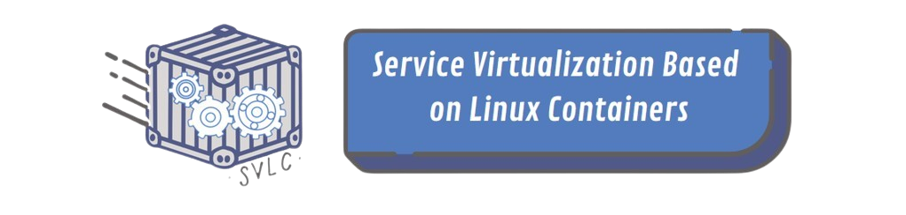
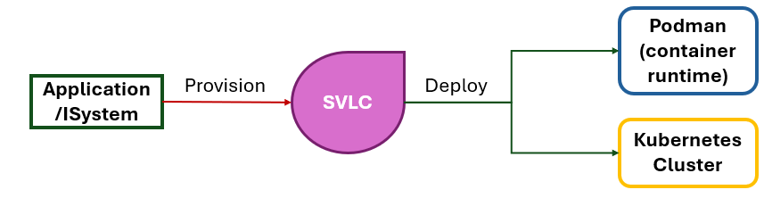

***Mechanisms to facilitate the deployment and provisioning of services in podman and kubernetes***

---

## Table of Contents
* [Introduction](#introduction)
* [Mechanisms](#mechanisms)
  * [Podman Mechanism](#podman-mechanism)
  * [Kubernetes Mechanism](#kubernetes-mechanism)
  * [Utility](#utility)
* [Artifacts](#artifacts)
  * [Maven](#maven)
  * [Gradle](#gradle)
* [Environment Variables](#environment-variables)
* [Dependencies](#dependencies)
* [Documentation](#documentation)

## Introduction

**SVLC** aims to reduce the complexity and manual work involved in deploying 
service elements. To this end, this software offers two big mechanisms to provide 
an automatic deployment of service elements in Podman pods or Kubernetes clusters. 
The first mechanism is the **Podman Mechanism**, which is responsible for deploying
simple service elements in Podman pods. The second mechanism is the **Kubernetes Mechanism**,
which is responsible for deploying more complex service elements in Kubernetes clusters.



## Mechanisms

### Podman Mechanism

The Podman Mechanism is responsible for deploying simple service elements in Podman pods.

**See [Podman Mechanism](svlc/docs/podman.md)**

### Kubernetes Mechanism

The Kubernetes Mechanism is responsible for deploying more complex service elements in Kubernetes clusters.

**See [Kubernetes Mechanism](svlc/docs/kubernetes.md)**

### Utility

**See [Utility](svlc/docs/utility.md)**

## Artifacts

### Maven

`pom.xml`

```xml
<project>
  <repositories>
    <repository>
      <id>github</id>
      <url>https://maven.pkg.github.com/daniel-m-carvalho/SVLC-Final_Project</url>
    </repository>
  </repositories>
  
  <dependencies>
    <dependency>
      <groupId>pt.isel.leic.svlc</groupId>
      <artifactId>mechanisms</artifactId>
      <version>*.*.*</version>
    </dependency>
  </dependencies>
</project>
```

`settings.xml`

```xml
<settings>
  <servers>
    <server>
      <id>github</id>
      <username>${env.GITHUB_USER}</username>
      <password>${env.GITHUB_TOKEN_WITH_PACKAGE_PERMISSIONS}</password>
    </server>
  </servers>
</settings>
```

## Gradle

`build.gradle`

```kotlin
repositories {
  maven {
    url = uri("https://maven.pkg.github.com/daniel-m-carvalho/SVLC-Final_Project")
    credentials {
        username = System.getenv("GITHUB_USER")
        password = System.getenv("GITHUB_TOKEN_WITH_PACKAGE_PERMISSIONS")
    }
  }
}

dependencies {
  implementation("pt.isel.leic.svlc:mechanisms:*.*.*")
}
```

## Environment Variables

* `GITHUB_USER` - GitHub username
* `GITHUB_TOKEN_WITH_PACKAGE_PERMISSIONS` - GitHub token with package permissions

Windows

```sh
set GITHUB_USER=<github_username>
set GITHUB_TOKEN_WITH_PACKAGE_PERMISSIONS=<github_token_with_read:packages_permitions>
```

Linux/MacOS

```bash
export GITHUB_USER=<github_username>
export GITHUB_TOKEN_WITH_PACKAGE_PERMISSIONS=<github_token_with_read:packages_permitions>
```

## Dependencies

* [Java 17](https://www.oracle.com/java/technologies/javase-jdk17-downloads.html)
* [Maven](https://maven.apache.org/download.cgi)
* [Gradle](https://gradle.org/install/)
* [Podman](https://podman.io/getting-started/installation)
* [Kubernetes](https://kubernetes.io/docs/tasks/tools/install-kubectl/)

## Documentation

To know more about the project theoretical and practical aspects, please check the **[project report](docs/final_version/svlc.pdf)**.

---

**Instituto Superior de Engenharia de Lisboa**<br>
**BSc in Computer Science and Engineering**<br>
**Project and Seminary**<br>
**Summer Semester of 2023/2024**
